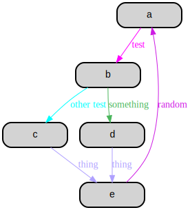
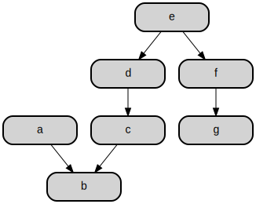
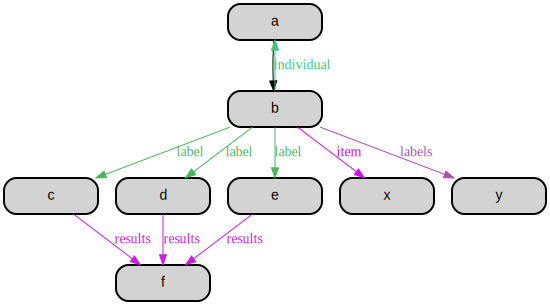
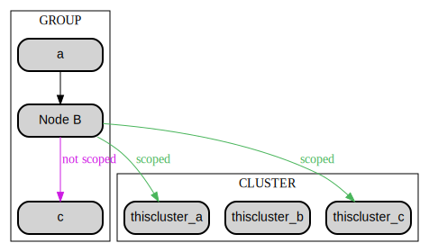
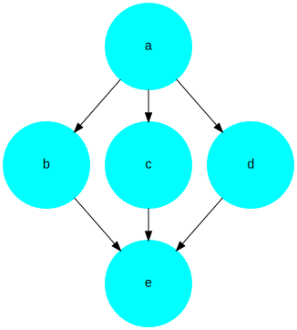
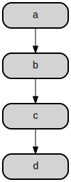
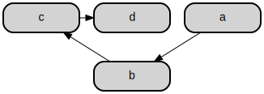
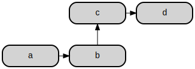
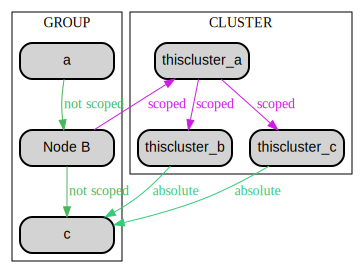
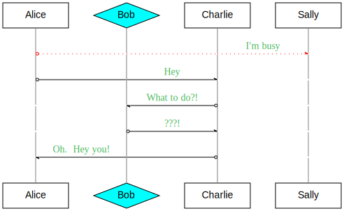

# Table of Contents

1.  [Introduction](#org93ffd97)
2.  [Installation](#orgb8d516c)
    1.  [Using straight.el](#orgbb6775f)
3.  [Syntax and Examples](#org34363e8)
    1.  [:labels](#orgb5ebb39)
    2.  [:chain](#org64ffce1)
    3.  [:fan](#org7b24c99)
    4.  [:group and :cluster](#orgacdd461)
    5.  [:node](#orgaf89e07)
    6.  [:rank](#org9d6f570)
    7.  [:properties](#org5f10f3e)
    8.  [:scope](#orgb5051d9)
    9.  [:sequence](#orgb606ca8)

# Introduction

Originally developed for my Emacs setup "Ryscomacs", rysco-graph is a domain specific language in Lisp for the Graphviz dot syntax and tools.

Many options are simply passed through, while other common patterns are made easier through macros.

See below for examples:

# Installation

## Using straight.el

    (straight-use-package '(rysco-graph :type git :repo "git@bitbucket.org:scott105/rysco-graph.git"))

# Syntax and Examples

## :labels

All connections with labels have a color generated for each unique label string. That color is used for all occurrences of that string.

To override this, `:labels` can be used to set explicit colors for certain strings.

    (rysco-graph
     nil
     '((:labels
        test magenta
        "other test" cyan
        thing "#AFA0FF")
    
       (:chain a [test] b
               (:fan ["other test"] c
                     [something] d)
               [thing] e
               [random] a)))

## :chain

    (rysco-graph
     nil
     '((:chain a b c)
       (:chain b [label text] d)
       (:chain
        e f g
        :break ;Breaks chain and effectively starts a new one
        h i j a)))

You can switch the arrow direction at anytime with `>` and `<`.

    (rysco-graph
     nil
     '((:chain a b < c d e > f g)))

## :fan

    (rysco-graph
     nil
     '((:chain a b [label] (:fan c d e) [results] f)
       (:chain b (:fan [individual] a [item] x [labels] y))))

## :group and :cluster

`:group` creates a logical grouping of nodes for applying styling, borders, and generally grouping things.
`:cluster` similarly creates a group, but also then adds the cluster name to all generated names as `cluster_node`.

    (rysco-graph
     nil
     '((:group
        thisgroup
        (:properties :label "GROUP")
        a
        (b :label "Node B")
        c)
    
       (:cluster
        thiscluster
        (:properties :label "CLUSTER")
        a
        b
        c)
    
       (:chain a b [scoped] (:fan thiscluster_a thiscluster_c))
       (:chain b ["not scoped"] c)))

## :node

A shorthand for specifying the default properties of nodes.

    (rysco-graph
     nil
     '((:node :shape circle :color cyan)
       (:chain a (:fan b c d) e)))

## :rank

For setting the explicit `rank` of a list of nodes.

    (rysco-graph
     nil
     '((:chain a b c d)))

    (rysco-graph
     '(:filename "Syntax and Examples--rank-alt1.svg")
     '((:rank min c d)
       (:chain a b c d)))

    (rysco-graph
     '(:filename "Syntax and Examples--rank-alt2.svg")
     '((:rank same a b)
       (:rank min c d)
       (:chain a b c d)))

## :properties

## :scope

The `:scope` helper is to make working with clusters (and nested clusters) more convenient.

    (rysco-graph
     nil
     '((:group
        thisgroup
        (:properties :label "GROUP")
        a
        (b :label "Node B")
        c)
    
       (:cluster
        thiscluster
        (:properties :label "CLUSTER")
        a
        b
        c)
    
       (:chain a ["not scoped"] b [scoped] (:scope thiscluster
                                                   :chain a [scoped] (:fan b c) [absolute] ^c))
       (:chain b ["not scoped"] c)))

## :sequence

This complex type creates channels of nodes that are connected to show a sequence. It&#x2026; just makes more sense if you see it.

    (rysco-graph
     nil
     '((:sequence
        test
        ((a "Alice")
         (b "Bob" :fillcolor cyan :shape diamond)
         (c "Charlie")
         (d "Sally"))
        (a d "I'm busy" :color red :style dotted)
        (a c "Hey")
        (c b "What to do?!")
        (b c "???!")
        (c a "Oh.  Hey you!"))))

